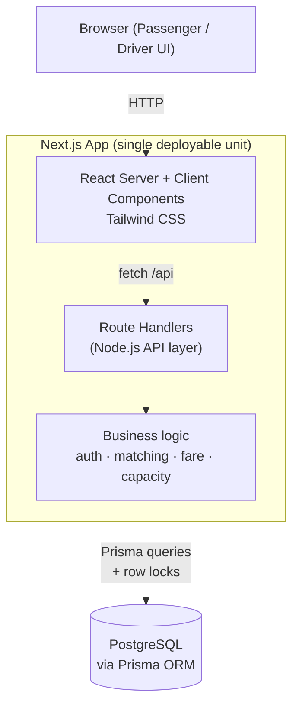

# Architecture — Dhaka Tesla Pool

## Request lifecycle
Browser → Next.js (UI) → Route Handler (API) → business logic → Prisma → PostgreSQL, and back.

## Why this shape
- **One Next.js app** serves the UI *and* the API (route handlers = the Node.js layer), so there's one thing to build, Dockerize, and deploy — the right call for a 5-day MVP.
- **Business logic lives in a service layer**, not inside route handlers, so pooling/fare/capacity rules are testable in isolation and reusable.
- **Prisma + PostgreSQL** with row-level locking is what makes the last-seat concurrency case safe.
- No queues, Redis, or microservices — added only when there's a reason (Section 9).