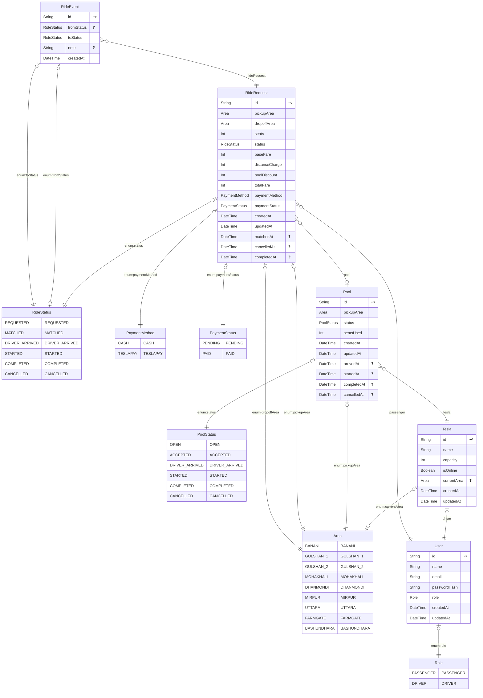

```mermaid
erDiagram

        Role {
            PASSENGER PASSENGER
DRIVER DRIVER
        }
    


        Area {
            BANANI BANANI
GULSHAN_1 GULSHAN_1
GULSHAN_2 GULSHAN_2
MOHAKHALI MOHAKHALI
DHANMONDI DHANMONDI
MIRPUR MIRPUR
UTTARA UTTARA
FARMGATE FARMGATE
BASHUNDHARA BASHUNDHARA
        }
    


        RideStatus {
            REQUESTED REQUESTED
MATCHED MATCHED
DRIVER_ARRIVED DRIVER_ARRIVED
STARTED STARTED
COMPLETED COMPLETED
CANCELLED CANCELLED
        }
    


        PoolStatus {
            OPEN OPEN
ACCEPTED ACCEPTED
DRIVER_ARRIVED DRIVER_ARRIVED
STARTED STARTED
COMPLETED COMPLETED
CANCELLED CANCELLED
        }
    


        PaymentMethod {
            CASH CASH
TESLAPAY TESLAPAY
        }
    


        PaymentStatus {
            PENDING PENDING
PAID PAID
        }
    
  "User" {
    String id "🗝️"
    String name 
    String email 
    String passwordHash 
    Role role 
    DateTime createdAt 
    DateTime updatedAt 
    }
  

  "Tesla" {
    String id "🗝️"
    String name 
    Int capacity 
    Boolean isOnline 
    Area currentArea "❓"
    DateTime createdAt 
    DateTime updatedAt 
    }
  

  "Pool" {
    String id "🗝️"
    Area pickupArea 
    PoolStatus status 
    Int seatsUsed 
    DateTime createdAt 
    DateTime updatedAt 
    DateTime arrivedAt "❓"
    DateTime startedAt "❓"
    DateTime completedAt "❓"
    DateTime cancelledAt "❓"
    }
  

  "RideRequest" {
    String id "🗝️"
    Area pickupArea 
    Area dropoffArea 
    Int seats 
    RideStatus status 
    Int baseFare 
    Int distanceCharge 
    Int poolDiscount 
    Int totalFare 
    PaymentMethod paymentMethod 
    PaymentStatus paymentStatus 
    DateTime createdAt 
    DateTime updatedAt 
    DateTime matchedAt "❓"
    DateTime cancelledAt "❓"
    DateTime completedAt "❓"
    }
  

  "RideEvent" {
    String id "🗝️"
    RideStatus fromStatus "❓"
    RideStatus toStatus 
    String note "❓"
    DateTime createdAt 
    }
  
    "User" |o--|| "Role" : "enum:role"
    "Tesla" |o--|o "Area" : "enum:currentArea"
    "Tesla" |o--|| "User" : "driver"
    "Pool" }o--|| "Tesla" : "tesla"
    "Pool" |o--|| "Area" : "enum:pickupArea"
    "Pool" |o--|| "PoolStatus" : "enum:status"
    "RideRequest" }o--|| "User" : "passenger"
    "RideRequest" |o--|| "Area" : "enum:pickupArea"
    "RideRequest" |o--|| "Area" : "enum:dropoffArea"
    "RideRequest" |o--|| "RideStatus" : "enum:status"
    "RideRequest" }o--|o "Pool" : "pool"
    "RideRequest" |o--|| "PaymentMethod" : "enum:paymentMethod"
    "RideRequest" |o--|| "PaymentStatus" : "enum:paymentStatus"
    "RideEvent" }o--|| "RideRequest" : "rideRequest"
    "RideEvent" |o--|o "RideStatus" : "enum:fromStatus"
    "RideEvent" |o--|| "RideStatus" : "enum:toStatus"
```
